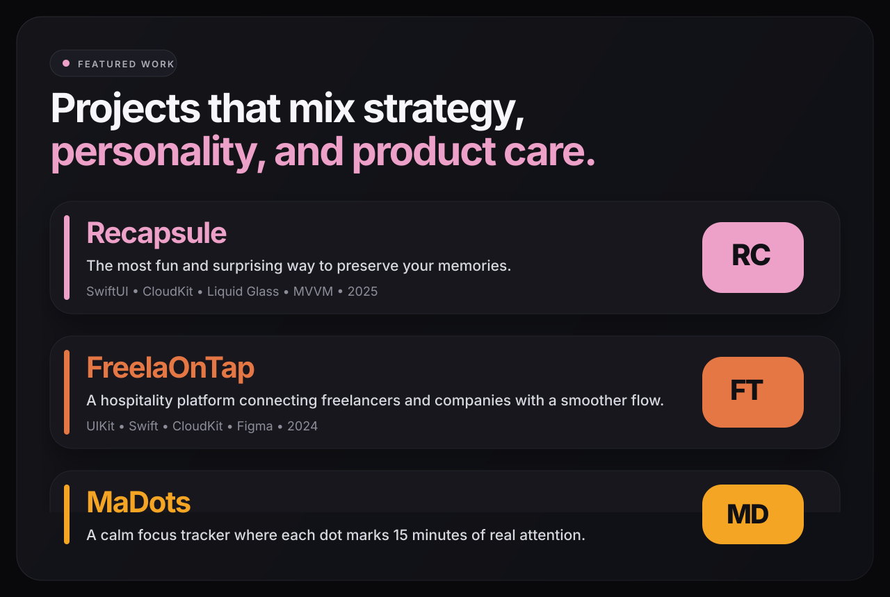

  

  <a href="https://anapolettoo.github.io/PortifolioAna/">Portfolio</a>
  ·
  <a href="https://www.linkedin.com/in/ana-poletto-2a7222318">LinkedIn</a>
  ·
  <a href="https://github.com/AnaPolettoo">GitHub</a>

I'm a Data Science & AI student and iOS Developer based in Porto Alegre, currently studying at PUCRS and part of the Apple Developer Academy. I like building products that solve real problems while still feeling thoughtful, playful, and visually intentional.

PT-BR

Sou estudante de Ciência de Dados e IA e iOS Developer, baseada em Porto Alegre, atualmente estudando na PUCRS e parte da Apple Developer Academy. Gosto de criar produtos que resolvem problemas reais sem abrir mão de uma experiência sensível, divertida e bem pensada.

I've shipped apps like [SinaLu](https://apps.apple.com/br/app/sinalu/id6752356555), [Pow Po Po](https://apps.apple.com/br/app/pow-po-po/id6760563455), and [Recapsule](https://apps.apple.com/br/app/recapsule/id6756196189), and I keep exploring the intersection of product design, iOS engineering, data, and AI.

  

### What I care about

- Building iOS experiences that feel polished, intuitive, and full of personality.
- Turning complex ideas into products people can actually understand and enjoy using.
- Mixing technology, design, and strategy to create things that are useful in the real world.

### Working with

`SwiftUI` `UIKit` `Swift` `CloudKit` `Python` `Machine Learning` `Data Analysis` `Data Visualization` `Artificial Intelligence` `Figma`

### Selected work

- [Recapsule](https://apps.apple.com/br/app/recapsule/id6756196189) - A memory app that transforms everyday moments into interactive photo puzzles.
- [SinaLu](https://apps.apple.com/br/app/sinalu/id6752356555) - An educational app that makes learning Libras from Rio Grande do Sul more fun and accessible.
- [Pow Po Po](https://apps.apple.com/br/app/pow-po-po/id6760563455) - A fast, one-finger survival game built around playful chaos and strategic upgrades.
- `FreelaOnTap` - A hospitality platform connecting freelancers and companies with a smoother hiring flow.
- `MaDots` - A calm focus tracker where each dot marks 15 minutes of real attention.
