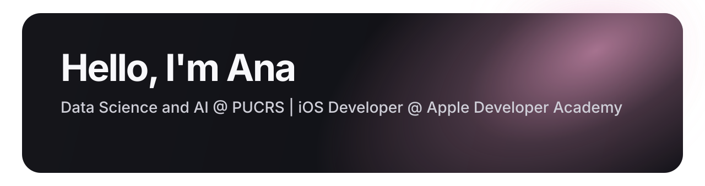
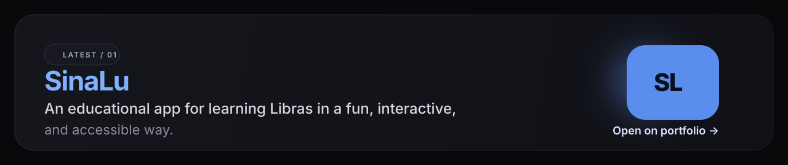
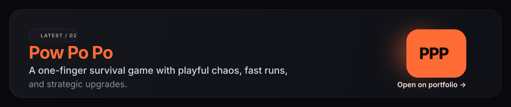

  

### Stacks

`SwiftUI` `UIKit` `Swift` `CloudKit` `Python` `Machine Learning` `Data Analysis` `Data Visualization` `Artificial Intelligence` `Figma`

### Last Projects

  

  

  <a href="https://anapolettoo.github.io/PortifolioAna/">See more on portfolio →</a>

